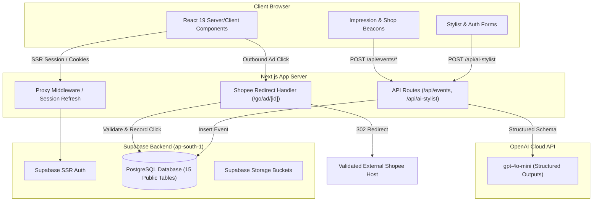
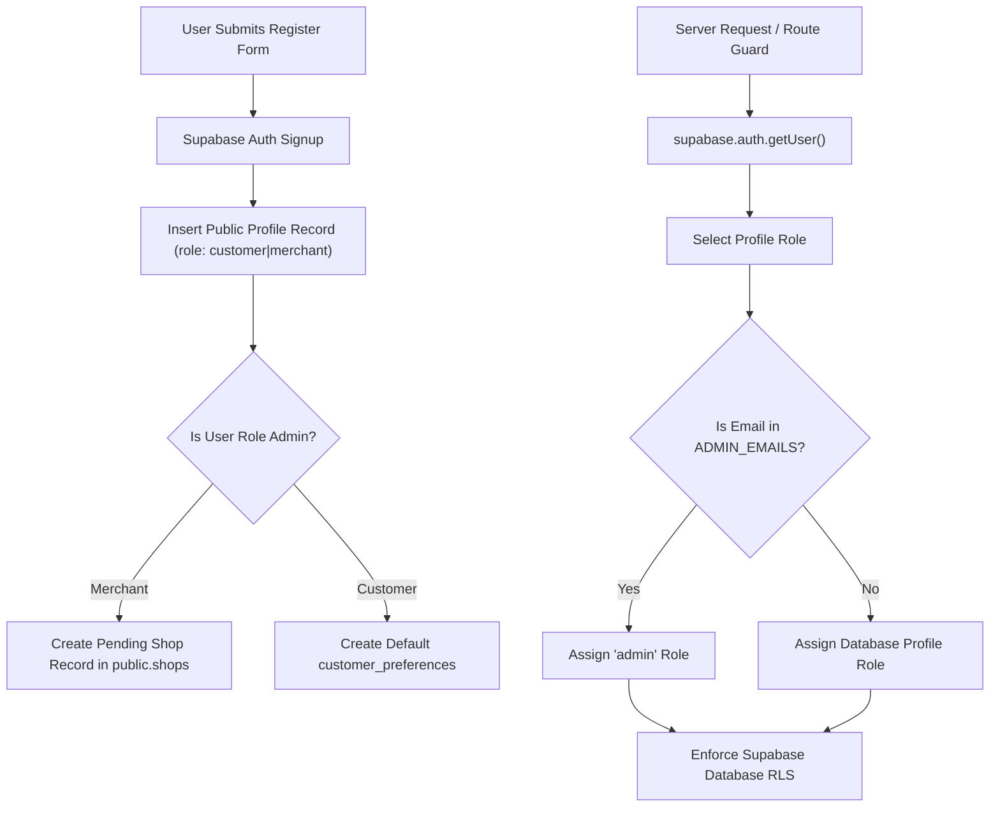
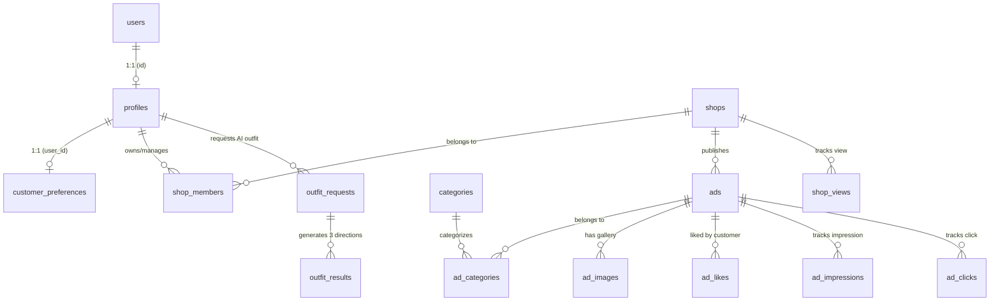
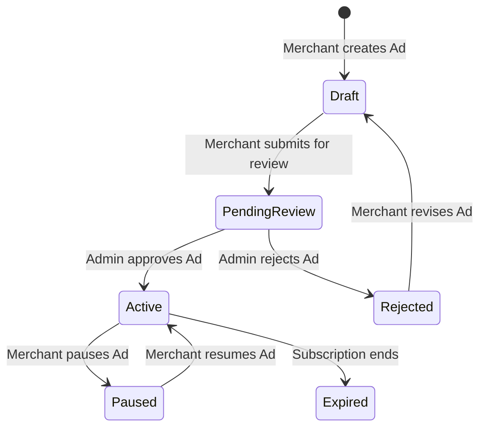

# FitToday — Codex Handoff Document

## 1. Executive Summary

FitToday (`วันนี้จะไปไหน ให้ AI ช่วยเลือกชุด`) is an independent Thai fashion discovery platform combining a neutral, body-positive AI outfit recommendation engine with an approved merchant advertising ecosystem. 

This handoff document provides a complete, factual, and self-contained reference for a new Codex session to inspect, test, review, and deploy the codebase safely without prior context.

### Current Project State
- **GitHub Repository:** `https://github.com/9natthaphong/fasion`
- **Working Branch:** `agent/complete-fittoday-predeploy`
- **Pull Request:** `https://github.com/9natthaphong/fasion/pull/1` (Draft PR open, unmerged)
- **Supabase Reference ID:** `pbapddmoprntydpsfirr` (Region: `ap-south-1` Mumbai, healthy)
- **Latest Commit:** `45a420c` (`feat(ui): establish Thai contemporary lookbook art direction and high-contrast merchant section`)

### Implementation & Verification Breakdown

| Dimension | Status | Details |
| :--- | :--- | :--- |
| **Source Code** | Implemented | Next.js 16 (App Router), React 19, TypeScript, Tailwind CSS v4 |
| **Live Database** | Applied & Healthy | Schema migration `20260727000100_initial_schema` and Security Advisor migration `20260727000200_advisors_remediation` applied to live Supabase |
| **Security Advisor** | Clean (0 warnings) | Revoked direct public access from private RPC functions; RLS enabled on all 15 public tables |
| **Automated Checks** | Passed | `npm run check` (`tsc --noEmit`, `eslint . --max-warnings=0`, `vitest run`, `next build`) passes with 0 errors and 0 warnings |
| **Unit Tests** | Passed | 35/35 Vitest unit tests passing across domain, migration, shopee, and validation logic |
| **Browser Inspection** | Visually Verified | Verified via Chrome DevTools MCP across 1440px desktop & 360px mobile viewports (0 horizontal overflow) |
| **Development CSP** | Fixed & Verified | Conditional CSP allows `eval()` and `ws:` in `development` mode without throwing browser overlays |
| **Production CSP** | Strict & Verified | Production CSP does **NOT** contain `'unsafe-eval'` |
| **Real User E2E** | Deferred | Live authenticated E2E flows deferred until test accounts are created |
| **Admin Access** | Fail-Closed | `ADMIN_EMAILS` is intentionally unset in `.env.example`; admin pages fail closed safely |
| **OpenAI Integration** | Ready / Blocked | Structured Outputs schema configured (`gpt-4o-mini`); live API calls return configuration notice when `OPENAI_API_KEY` is missing |
| **PR Status** | Unmerged | PR #1 remains open on branch `agent/complete-fittoday-predeploy` (not merged to `main`) |
| **Deployment** | Not Deployed | Vercel deployment intentionally deferred for final Codex approval |

---

## 2. Product Boundaries

FitToday separates AI styling advice from paid advertising to maintain user trust and neutrality.

```
┌─────────────────────────────────────────────────────────────────────────┐
│                           FitToday Platform                             │
├────────────────────────────────────┬────────────────────────────────────┤
│         AI Stylist System          │     Fashion Advertising System     │
│       (Neutral Advice Engine)      │      (Merchant Commerce Space)     │
├────────────────────────────────────┼────────────────────────────────────┤
│ • 100% Unbiased outfit advice      │ • Independent merchant profiles    │
│ • Exactly 3 outfit directions:     │ • Approved advertisements          │
│   1. Safe (เรียบง่าย ใส่ง่าย)           │ • Direct Shopee outbound links     │
│   2. Elevated (แต่งขึ้นอีกระดับ)       │ • Impression / Click / View tracking│
│   3. Comfortable (สบายและคล่องตัว)   │ • Merchant Studio analytics (CTR)  │
│ • Zero sponsored placement in AI   │ • Admin moderation queue           │
│ • No real garment links in AI      │ • Strict Shopee URL validation     │
└────────────────────────────────────┴────────────────────────────────────┘
```

### Out-of-Scope MVP Features (Intentionally Excluded)
To preserve project focus, the following features are explicitly **out of scope**:
- No shopping cart
- No in-app checkout
- No payment gateway / payment processing
- No inventory stock management
- No shipping or logistics tracking
- No order returns / refunds
- No virtual AR/3D try-on

---

## 3. Repository and Git State

- **Repository URL:** `https://github.com/9natthaphong/fasion`
- **Default Branch:** `main`
- **Working Branch:** `agent/complete-fittoday-predeploy`
- **Pull Request URL:** `https://github.com/9natthaphong/fasion/pull/1`
- **Pull Request Status:** Open Draft PR (Unmerged)
- **Package Manager:** `npm` (Lockfile: `package-lock.json`)

### Key Commit History

| Commit Hash | Author | Purpose |
| :--- | :--- | :--- |
| `45a420c` | AI Agent | `feat(ui): establish Thai contemporary lookbook art direction and high-contrast merchant section` |
| `e6369a3` | AI Agent | `fix(ui): replace generic AI landing patterns with editorial art direction and licensed photography` |
| `5dd16f9` | AI Agent | `feat(ui): complete editorial visual redesign, Thai font integration, and guided AI Stylist UX` |
| `01138df` | AI Agent | `feat(supabase): apply live initial schema and advisor remediation migration, update OpenAI model default` |
| `a4155ea` | AI Agent | `fix(security): improve Supabase SSR session handling, admin key safety fallbacks, and update documentation` |

---

## 4. Actual Technology Stack

Extracted directly from [`package.json`](file:///C:/Users/user/Documents/klog/ai1/fittoday-ai-fashion-source/package.json):

### Production Dependencies
- **Framework:** `next` v16.2.12 (App Router with Turbopack)
- **UI Engine:** `react` v19.2.4 & `react-dom` v19.2.4
- **Language:** `typescript` v5.x
- **Styling:** `tailwindcss` v4.0.0 & `@tailwindcss/postcss` v4.0.0
- **Database & Auth:** `@supabase/supabase-js` v2.110.8 & `@supabase/ssr` v0.12.3
- **AI SDK:** `openai` v6.49.0 (Structured Outputs API)
- **Validation:** `zod` v4.4.3
- **Form Management:** `react-hook-form` v7.83.0 with `@hookform/resolvers` v5.5.7
- **Icons:** `lucide-react` v1.27.0

### Development Dependencies
- **Testing:** `vitest` v4.1.10 (Unit tests), `@testing-library/react` v16.3.2, `jsdom` v29.1.1
- **E2E Testing Framework:** `@playwright/test` v1.62.0
- **Linter & Formatter:** `eslint` v9.x, `eslint-config-next` v16.2.12, `prettier` v3.9.6
- **Database CLI:** `supabase` v2.109.1

---

## 5. Architecture Overview

FitToday is constructed on Next.js App Router using Server Components for data fetching and SSR authentication, Client Components for interactive forms and beacons, and API Route Handlers for event recording and AI generation.



---

## 6. Important Repository Paths

| Path | Purpose |
| :--- | :--- |
| [`src/app/layout.tsx`](file:///C:/Users/user/Documents/klog/ai1/fittoday-ai-fashion-source/src/app/layout.tsx) | Root layout loading `Noto_Sans_Thai` and `Noto_Serif_Thai` font loaders |
| [`src/app/globals.css`](file:///C:/Users/user/Documents/klog/ai1/fittoday-ai-fashion-source/src/app/globals.css) | Core CSS variables, typography tokens, button styles, and responsive breakpoints |
| [`src/app/page.tsx`](file:///C:/Users/user/Documents/klog/ai1/fittoday-ai-fashion-source/src/app/page.tsx) | Redesigned homepage featuring 3-direction signature lookbook & dark merchant panel |
| [`src/app/ai-stylist/page.tsx`](file:///C:/Users/user/Documents/klog/ai1/fittoday-ai-fashion-source/src/app/ai-stylist/page.tsx) | AI Stylist consultation page entrypoint |
| [`src/app/api/ai-stylist/route.ts`](file:///C:/Users/user/Documents/klog/ai1/fittoday-ai-fashion-source/src/app/api/ai-stylist/route.ts) | OpenAI `gpt-4o-mini` API endpoint with Zod structured output schema |
| [`src/app/go/ad/[id]/route.ts`](file:///C:/Users/user/Documents/klog/ai1/fittoday-ai-fashion-source/src/app/go/ad/[id]/route.ts) | Shopee URL redirect handler with SSR click recording and host allowlist check |
| [`src/lib/supabase/server.ts`](file:///C:/Users/user/Documents/klog/ai1/fittoday-ai-fashion-source/src/lib/supabase/server.ts) | Supabase SSR server client factory using Next.js cookies |
| [`src/lib/supabase/client.ts`](file:///C:/Users/user/Documents/klog/ai1/fittoday-ai-fashion-source/src/lib/supabase/client.ts) | Supabase browser client factory |
| [`src/lib/auth.ts`](file:///C:/Users/user/Documents/klog/ai1/fittoday-ai-fashion-source/src/lib/auth.ts) | `getCurrentUser()`, `requirePageRole()`, and `requireApiRole()` authorization helpers |
| [`src/lib/env.ts`](file:///C:/Users/user/Documents/klog/ai1/fittoday-ai-fashion-source/src/lib/env.ts) | Environment detection and `ADMIN_EMAILS` parser |
| [`src/lib/validation.ts`](file:///C:/Users/user/Documents/klog/ai1/fittoday-ai-fashion-source/src/lib/validation.ts) | Zod schemas for login, register, ad creation, profile editing, and Shopee URLs |
| [`src/lib/shopee.ts`](file:///C:/Users/user/Documents/klog/ai1/fittoday-ai-fashion-source/src/lib/shopee.ts) | Strict Shopee URL domain allowlist and HTTPS sanitizer |
| [`next.config.ts`](file:///C:/Users/user/Documents/klog/ai1/fittoday-ai-fashion-source/next.config.ts) | Next.js configuration with development/production CSP headers |
| [`supabase/migrations/`](file:///C:/Users/user/Documents/klog/ai1/fittoday-ai-fashion-source/supabase/migrations/) | SQL migration history applied to live Supabase project |
| [`supabase/seed.sql`](file:///C:/Users/user/Documents/klog/ai1/fittoday-ai-fashion-source/supabase/seed.sql) | Idempotent seed data for categories, demo shops, demo ads, and analytics |
| [`public/demo-assets/ATTRIBUTION.md`](file:///C:/Users/user/Documents/klog/ai1/fittoday-ai-fashion-source/public/demo-assets/ATTRIBUTION.md) | Royalty-free Unsplash photography attribution documentation |

---

## 7. Route Inventory

### Public Routes

| Route | Purpose | Auth Req. | Implementation Status | Main Files |
| :--- | :--- | :--- | :--- | :--- |
| `/` | Editorial Homepage | None | Implemented & Verified | [`src/app/page.tsx`](file:///C:/Users/user/Documents/klog/ai1/fittoday-ai-fashion-source/src/app/page.tsx) |
| `/ai-stylist` | AI Outfit Consultation | None | Implemented & Verified | [`src/app/ai-stylist/page.tsx`](file:///C:/Users/user/Documents/klog/ai1/fittoday-ai-fashion-source/src/app/ai-stylist/page.tsx) |
| `/discover` | Sponsored Fashion Gallery | None | Implemented & Verified | [`src/app/discover/page.tsx`](file:///C:/Users/user/Documents/klog/ai1/fittoday-ai-fashion-source/src/app/discover/page.tsx) |
| `/categories/[slug]` | Category Gallery | None | Implemented & Verified | [`src/app/categories/[slug]/page.tsx`](file:///C:/Users/user/Documents/klog/ai1/fittoday-ai-fashion-source/src/app/categories/[slug]/page.tsx) |
| `/shops/[slug]` | Shop Profile & Catalog | None | Implemented & Verified | [`src/app/shops/[slug]/page.tsx`](file:///C:/Users/user/Documents/klog/ai1/fittoday-ai-fashion-source/src/app/shops/[slug]/page.tsx) |
| `/ads/[slug]` | Ad Detail View | None | Implemented & Verified | [`src/app/ads/[slug]/page.tsx`](file:///C:/Users/user/Documents/klog/ai1/fittoday-ai-fashion-source/src/app/ads/[slug]/page.tsx) |
| `/login/customer` | Customer Login | Guest | Implemented & Verified | [`src/app/login/customer/page.tsx`](file:///C:/Users/user/Documents/klog/ai1/fittoday-ai-fashion-source/src/app/login/customer/page.tsx) |
| `/login/merchant` | Merchant Login | Guest | Implemented & Verified | [`src/app/login/merchant/page.tsx`](file:///C:/Users/user/Documents/klog/ai1/fittoday-ai-fashion-source/src/app/login/merchant/page.tsx) |
| `/register/customer` | Customer Registration | Guest | Implemented & Verified | [`src/app/register/customer/page.tsx`](file:///C:/Users/user/Documents/klog/ai1/fittoday-ai-fashion-source/src/app/register/customer/page.tsx) |
| `/register/merchant` | Merchant Registration | Guest | Implemented & Verified | [`src/app/register/merchant/page.tsx`](file:///C:/Users/user/Documents/klog/ai1/fittoday-ai-fashion-source/src/app/register/merchant/page.tsx) |
| `/privacy` | Privacy Policy | None | Implemented & Verified | [`src/app/privacy/page.tsx`](file:///C:/Users/user/Documents/klog/ai1/fittoday-ai-fashion-source/src/app/privacy/page.tsx) |
| `/terms` | Terms of Service | None | Implemented & Verified | [`src/app/terms/page.tsx`](file:///C:/Users/user/Documents/klog/ai1/fittoday-ai-fashion-source/src/app/terms/page.tsx) |

### Customer Account Routes

| Route | Purpose | Auth Req. | Implementation Status | Main Files |
| :--- | :--- | :--- | :--- | :--- |
| `/account` | Wardrobe Hub | `customer` | Implemented (Not E2E tested) | [`src/app/account/page.tsx`](file:///C:/Users/user/Documents/klog/ai1/fittoday-ai-fashion-source/src/app/account/page.tsx) |
| `/account/profile` | Preference Form | `customer` | Implemented (Not E2E tested) | [`src/app/account/profile/page.tsx`](file:///C:/Users/user/Documents/klog/ai1/fittoday-ai-fashion-source/src/app/account/profile/page.tsx) |
| `/account/outfits` | Saved AI Outfits | `customer` | Implemented (Not E2E tested) | [`src/app/account/outfits/page.tsx`](file:///C:/Users/user/Documents/klog/ai1/fittoday-ai-fashion-source/src/app/account/outfits/page.tsx) |
| `/account/likes` | Liked Ads Gallery | `customer` | Implemented (Not E2E tested) | [`src/app/account/likes/page.tsx`](file:///C:/Users/user/Documents/klog/ai1/fittoday-ai-fashion-source/src/app/account/likes/page.tsx) |
| `/account/settings` | Delete Account | `customer` | Implemented (Not E2E tested) | [`src/app/account/settings/page.tsx`](file:///C:/Users/user/Documents/klog/ai1/fittoday-ai-fashion-source/src/app/account/settings/page.tsx) |

### Merchant Studio Routes

| Route | Purpose | Auth Req. | Implementation Status | Main Files |
| :--- | :--- | :--- | :--- | :--- |
| `/merchant` | Studio Dashboard | `merchant` | Implemented (Not E2E tested) | [`src/app/merchant/page.tsx`](file:///C:/Users/user/Documents/klog/ai1/fittoday-ai-fashion-source/src/app/merchant/page.tsx) |
| `/merchant/shop` | Shop Management | `merchant` | Implemented (Not E2E tested) | [`src/app/merchant/shop/page.tsx`](file:///C:/Users/user/Documents/klog/ai1/fittoday-ai-fashion-source/src/app/merchant/shop/page.tsx) |
| `/merchant/ads` | Ad List & Status | `merchant` | Implemented (Not E2E tested) | [`src/app/merchant/ads/page.tsx`](file:///C:/Users/user/Documents/klog/ai1/fittoday-ai-fashion-source/src/app/merchant/ads/page.tsx) |
| `/merchant/ads/new` | Create Ad Form | `merchant` | Implemented (Not E2E tested) | [`src/app/merchant/ads/new/page.tsx`](file:///C:/Users/user/Documents/klog/ai1/fittoday-ai-fashion-source/src/app/merchant/ads/new/page.tsx) |
| `/merchant/ads/[id]/edit` | Edit Ad Form | `merchant` | Implemented (Not E2E tested) | [`src/app/merchant/ads/[id]/edit/page.tsx`](file:///C:/Users/user/Documents/klog/ai1/fittoday-ai-fashion-source/src/app/merchant/ads/[id]/edit/page.tsx) |
| `/merchant/analytics` | Ad Performance | `merchant` | Implemented (Not E2E tested) | [`src/app/merchant/analytics/page.tsx`](file:///C:/Users/user/Documents/klog/ai1/fittoday-ai-fashion-source/src/app/merchant/analytics/page.tsx) |
| `/merchant/settings` | Shop Settings | `merchant` | Implemented (Not E2E tested) | [`src/app/merchant/settings/page.tsx`](file:///C:/Users/user/Documents/klog/ai1/fittoday-ai-fashion-source/src/app/merchant/settings/page.tsx) |

### Admin Moderation Routes

| Route | Purpose | Auth Req. | Implementation Status | Main Files |
| :--- | :--- | :--- | :--- | :--- |
| `/admin` | Moderation Overview | `admin` | Configuration Blocked (Unset `ADMIN_EMAILS`) | [`src/app/admin/page.tsx`](file:///C:/Users/user/Documents/klog/ai1/fittoday-ai-fashion-source/src/app/admin/page.tsx) |
| `/admin/shops` | Shop Moderation | `admin` | Configuration Blocked | [`src/app/admin/shops/page.tsx`](file:///C:/Users/user/Documents/klog/ai1/fittoday-ai-fashion-source/src/app/admin/shops/page.tsx) |
| `/admin/ads` | Ad Approval Queue | `admin` | Configuration Blocked | [`src/app/admin/ads/page.tsx`](file:///C:/Users/user/Documents/klog/ai1/fittoday-ai-fashion-source/src/app/admin/ads/page.tsx) |
| `/admin/users` | User Directory | `admin` | Configuration Blocked | [`src/app/admin/users/page.tsx`](file:///C:/Users/user/Documents/klog/ai1/fittoday-ai-fashion-source/src/app/admin/users/page.tsx) |
| `/admin/analytics` | System Metrics | `admin` | Configuration Blocked | [`src/app/admin/analytics/page.tsx`](file:///C:/Users/user/Documents/klog/ai1/fittoday-ai-fashion-source/src/app/admin/analytics/page.tsx) |

### API / Route Handlers

| Endpoint | Method | Auth Req. | Purpose | Main Files |
| :--- | :--- | :--- | :--- | :--- |
| `/api/auth/login` | `POST` | Guest | User login handler | [`src/app/api/auth/login/route.ts`](file:///C:/Users/user/Documents/klog/ai1/fittoday-ai-fashion-source/src/app/api/auth/login/route.ts) |
| `/api/auth/register` | `POST` | Guest | Customer/Merchant registration handler | [`src/app/api/auth/register/route.ts`](file:///C:/Users/user/Documents/klog/ai1/fittoday-ai-fashion-source/src/app/api/auth/register/route.ts) |
| `/api/auth/logout` | `POST` | Authenticated | Logout session handler | [`src/app/api/auth/logout/route.ts`](file:///C:/Users/user/Documents/klog/ai1/fittoday-ai-fashion-source/src/app/api/auth/logout/route.ts) |
| `/api/ai-stylist` | `POST` | Optional | OpenAI outfit recommendation engine | [`src/app/api/ai-stylist/route.ts`](file:///C:/Users/user/Documents/klog/ai1/fittoday-ai-fashion-source/src/app/api/ai-stylist/route.ts) |
| `/go/ad/[id]` | `GET` | Public | Outbound Shopee redirect & click tracker | [`src/app/go/ad/[id]/route.ts`](file:///C:/Users/user/Documents/klog/ai1/fittoday-ai-fashion-source/src/app/go/ad/[id]/route.ts) |
| `/api/events/impression` | `POST` | Public | Ad impression beacon receiver | [`src/app/api/events/impression/route.ts`](file:///C:/Users/user/Documents/klog/ai1/fittoday-ai-fashion-source/src/app/api/events/impression/route.ts) |
| `/api/events/shop-view` | `POST` | Public | Shop page view beacon receiver | [`src/app/api/events/shop-view/route.ts`](file:///C:/Users/user/Documents/klog/ai1/fittoday-ai-fashion-source/src/app/api/events/shop-view/route.ts) |
| `/api/likes/[id]` | `POST`/`DELETE` | `customer` | Like / Unlike ad handler | [`src/app/api/likes/[id]/route.ts`](file:///C:/Users/user/Documents/klog/ai1/fittoday-ai-fashion-source/src/app/api/likes/[id]/route.ts) |
| `/api/merchant/ads` | `GET`/`POST` | `merchant` | Merchant ad listing & creation | [`src/app/api/merchant/ads/route.ts`](file:///C:/Users/user/Documents/klog/ai1/fittoday-ai-fashion-source/src/app/api/merchant/ads/route.ts) |
| `/api/merchant/shop` | `GET`/`PATCH` | `merchant` | Merchant shop profile management | [`src/app/api/merchant/shop/route.ts`](file:///C:/Users/user/Documents/klog/ai1/fittoday-ai-fashion-source/src/app/api/merchant/shop/route.ts) |

---

## 8. Authentication and Authorization

FitToday manages user authentication through Supabase Auth (cookie-based SSR sessions via `@supabase/ssr`).



### Role Authorization Logic
- **`customer`**: Created upon registration at `/register/customer`. Restricted to customer wardrobe pages (`/account/*`) and ad likes.
- **`merchant`**: Created upon registration at `/register/merchant`. Automatically creates a pending shop record in `public.shops` and grants access to `/merchant/*`.
- **`admin`**: Granted dynamically in server-side helpers [`src/lib/auth.ts`](file:///C:/Users/user/Documents/klog/ai1/fittoday-ai-fashion-source/src/lib/auth.ts) **only** if the authenticated user's email is present in the `ADMIN_EMAILS` environment variable. 

### Security Safeguards
1. **Fail-Closed Admin Protection:** When `ADMIN_EMAILS` is unset, `getAdminEmails().has(...)` evaluates to `false`, preventing any user from obtaining admin permissions.
2. **Frontend Role Escalation Prevention:** Roles cannot be escalated by mutating client state; database RLS policies enforce `role` immutability via `public.is_admin()`.

---

## 9. Environment Variables

| Variable | Scope | Required For | Current Status | Exposure Safety |
| :--- | :--- | :--- | :--- | :--- |
| `NEXT_PUBLIC_SUPABASE_URL` | Public (Client + Server) | Supabase API connection | Configured | Safe (`NEXT_PUBLIC_`) |
| `NEXT_PUBLIC_SUPABASE_PUBLISHABLE_KEY` | Public (Client + Server) | Supabase Auth & RLS queries | Configured | Safe (`NEXT_PUBLIC_`) |
| `SUPABASE_SECRET_KEY` | Server-only | Database migrations & admin CLI | Configured | **Server-only** (Never expose to browser) |
| `OPENAI_API_KEY` | Server-only | OpenAI `gpt-4o-mini` API calls | Absent / Not set | **Server-only** (Never expose to browser) |
| `OPENAI_MODEL` | Server-only | OpenAI model fallback | Optional (`gpt-4o-mini`) | Server-only |
| `ADMIN_EMAILS` | Server-only | Comma-separated admin email list | Unset (`""`) | **Server-only** (Never expose to browser) |
| `NEXT_PUBLIC_SITE_URL` | Public (Client + Server) | Canonical URL & OAuth callbacks | Optional (Fallback: `http://localhost:3000`) | Safe (`NEXT_PUBLIC_`) |

> [!CAUTION]
> Secrets (such as `SUPABASE_SECRET_KEY` or `OPENAI_API_KEY`) must **never** be prefixed with `NEXT_PUBLIC_` or committed to source control. `.env.local` is listed in `.gitignore`.

---

## 10. Live Supabase State

- **Project ID:** `pbapddmoprntydpsfirr`
- **Region:** `ap-south-1` (Mumbai)
- **Status:** Healthy (0 security advisor warnings)

### Applied Live Migrations
1. `20260727000100_initial_schema.sql`: 15 public tables, RLS policies, indexes, and triggers.
2. `20260727000200_advisors_remediation.sql`: Revoked direct public execute permissions from `consume_rate_limit` and `record_admin_audit` private RPC functions.

### Live Table Schema & Verified Seed Counts

| Table Name | Purpose | RLS Enabled | Live Seed Count |
| :--- | :--- | :---: | :---: |
| `public.profiles` | User accounts and role mapping | Yes | 0 (User-driven) |
| `public.customer_preferences` | Wardrobe and size metrics | Yes | 0 (User-driven) |
| `public.shops` | Merchant store profiles | Yes | 4 demo shops |
| `public.shop_members` | Store ownership and staff | Yes | 0 (User-driven) |
| `public.categories` | Style occasion categories | Yes | 15 categories |
| `public.ads` | Advertisements and Shopee URLs | Yes | 16 demo ads |
| `public.ad_categories` | Ad-to-category junction | Yes | 16 entries |
| `public.ad_images` | Additional ad image gallery | Yes | 0 |
| `public.ad_likes` | Customer favorite ads | Yes | 0 |
| `public.ad_impressions` | Impression tracking events | Yes | 480 demo events |
| `public.ad_clicks` | Shopee outbound click events | Yes | 128 demo events |
| `public.shop_views` | Shop profile view events | Yes | 96 demo events |
| `public.outfit_requests` | User AI outfit requests | Yes | 0 |
| `public.outfit_results` | Generated AI outfit results | Yes | 0 |
| `public.account_deletion_requests` | Compliance deletion log | Yes | 0 |
| `private.admin_audit_log` | Private audit trail | Yes | 0 |
| `private.api_rate_limits` | Private rate limit counters | Yes | 0 |

---

## 11. Database Relationships



---

## 12. RLS and Security Model

All 15 public tables have Row Level Security (**RLS**) strictly enabled.

### Access Control Matrix

| Table / Resource | Public Role | Customer Role | Merchant Role | Admin Role |
| :--- | :--- | :--- | :--- | :--- |
| `profiles` | Read self | Read/Update self | Read/Update self | Full Read |
| `customer_preferences` | None | Read/Update self | None | Full Read |
| `shops` | Read `approved` | Read `approved` | Read/Update owned shop | Full Access |
| `ads` | Read `active` | Read `active` | Read/Insert/Update owned ads | Full Access |
| `ad_likes` | None | Read/Insert/Delete self | None | Full Access |
| `ad_impressions` | Insert (Beacon) | Insert (Beacon) | Read owned ad analytics | Full Access |
| `ad_clicks` | Insert (Redirect) | Insert (Redirect) | Read owned ad analytics | Full Access |
| `shop_views` | Insert (Beacon) | Insert (Beacon) | Read owned shop views | Full Access |
| `outfit_requests` | None | Read/Insert self | None | Full Read |
| `Storage Buckets` | Read public assets | Read public assets | Upload to owned shop/ad path | Full Access |

---

## 13. Storage

FitToday utilizes 3 configured Supabase Storage buckets:

1. `avatars` (Public, 2MB limit, image MIME types): User profile avatars.
2. `shop-assets` (Public, 5MB limit, image MIME types): Shop logos and cover photos.
3. `ad-assets` (Public, 5MB limit, image MIME types): Ad main covers and gallery images.

### Upload Path Convention
- Shop Covers: `shop-assets/shops/{shop_id}/cover-{timestamp}.jpg`
- Ad Cover Images: `ad-assets/shops/{shop_id}/ads/{ad_id}/cover-{timestamp}.jpg`

---

## 14. AI Stylist

The AI Stylist endpoint is implemented in [`src/app/api/ai-stylist/route.ts`](file:///C:/Users/user/Documents/klog/ai1/fittoday-ai-fashion-source/src/app/api/ai-stylist/route.ts) using the OpenAI `gpt-4o-mini` model with Structured Outputs.

### Key Rules & Behavior
1. **3 Distinct Directions:** Every recommendation returns exactly 3 outfit options:
   - `safe`: Classic, versatile, low-risk combination.
   - `elevated`: Tailored, stylish, statement layering.
   - `comfortable`: Relaxed, breathable, high-mobility outfit.
2. **Body-Positive Safety:** System prompts explicitly prohibit criticizing body size or shape.
3. **Sizing Disclaimer:** Explicitly notifies users that size recommendations are estimates and requires checking vendor size charts.
4. **Missing Key Handling:** Returns a clear `configuration_missing` JSON response when `OPENAI_API_KEY` is not configured on the server environment.

---

## 15. Advertising and Moderation Workflow



---

## 16. Shopee URL and Redirect Security

Outbound ad clicks are routed through [`src/app/go/ad/[id]/route.ts`](file:///C:/Users/user/Documents/klog/ai1/fittoday-ai-fashion-source/src/app/go/ad/[id]/route.ts) to record click analytics before redirecting to external e-commerce stores.

### Security Controls
- **Host Allowlist:** Destination URLs are validated by [`src/lib/shopee.ts`](file:///C:/Users/user/Documents/klog/ai1/fittoday-ai-fashion-source/src/lib/shopee.ts) against an allowlist of valid Shopee domains (`shopee.co.th`, `s.shopee.co.th`, `shope.ee`).
- **Open Redirect Prevention:** Destinations are retrieved directly from the validated database record for the ad; destination URLs passed via client query parameters are rejected.
- **HTTPS Enforcement:** Protocol must be strictly `https://`.

---

## 17. Tracking and Analytics

FitToday collects non-intrusive event analytics:

1. **Impressions:** Triggered via `IntersectionObserver` when an ad card is 50% visible for at least 1 second. Deduplicated per session.
2. **Likes:** Requires customer authentication. Enforced by unique database constraint on `(ad_id, user_id)`.
3. **Clicks:** Recorded server-side during the `/go/ad/[id]` redirect execution.
4. **Shop Views:** Recorded when visiting `/shops/[slug]`.
5. **CTR Calculation:** Calculated as `(clicks / impressions) * 100` (returns `0.00%` when impressions are zero).

---

## 18. Design System and Current UI

- **Design Aesthetic:** **Thai Contemporary Lookbook** (high-contrast naturalism,Bodoni/Serif display headings + Noto Sans Thai body text, 0px sharp guillotine-cut frames).
- **Color Palette:**
  - Canvas: Warm Ivory `#F4F0E8`
  - Paper: `#FBF9F4`
  - Charcoal Ink: `#161713`
  - Dark Panel: `#171814`
  - Dark Panel Text: `#F4F0E8`
  - Muted Text: `#52514B` (Contrast ratio 6.5:1 on ivory, WCAG AA compliant)
- **Asset Attribution:** Royalty-free Unsplash photography documented in [`public/demo-assets/ATTRIBUTION.md`](file:///C:/Users/user/Documents/klog/ai1/fittoday-ai-fashion-source/public/demo-assets/ATTRIBUTION.md).
- **Development CSP Fix:** Conditional CSP in [`next.config.ts`](file:///C:/Users/user/Documents/klog/ai1/fittoday-ai-fashion-source/next.config.ts) enables `eval()` in `development` mode while keeping `production` strictly without `unsafe-eval`.

---

## 19. Verification Evidence

| Verification Check | Status | Execution Command | Result / Evidence |
| :--- | :---: | :--- | :--- |
| `npm ci` / `install` | **Passed** | `npm install` | All dependencies installed cleanly |
| `typecheck` | **Passed** | `npm run typecheck` | `tsc --noEmit` exited with code 0 (0 errors) |
| `lint` | **Passed** | `npm run lint` | `eslint . --max-warnings=0` exited with code 0 (0 warnings) |
| Vitest Unit Tests | **Passed** | `npm test` | 35/35 unit tests passed across 4 test suites |
| Next Production Build | **Passed** | `npm run build` | 25 static & dynamic pages compiled successfully |
| `npm audit` | **Reported** | `npm audit` | 12 high-severity vulnerabilities (transitive devDependencies) |
| Live Supabase Schema | **Passed** | `apply_migration` MCP | `20260727000100` & `20260727000200` applied live |
| Supabase Security Advisor | **Passed** | `get_advisors` MCP | 0 warnings / 0 lints returned |
| Browser Console | **Passed** | Chrome DevTools MCP | 0 errors, 0 CSP violations in development mode |
| Mobile Responsive QA | **Passed** | Chrome DevTools MCP | 0 horizontal overflow at 360px (`scrollWidth: 485` in 500) |
| Development CSP | **Passed** | `npm run dev` | `eval()` permitted in dev mode without overlay |
| Production CSP | **Passed** | `npm run build` | Production headers send strict CSP without `unsafe-eval` |
| Authenticated User E2E | **Deferred** | Manual / Playwright | Deferred until real test accounts are created |
| Live OpenAI Request | **Deferred** | API Route call | Deferred until `OPENAI_API_KEY` is set on server |
| Vercel Deployment | **Deferred** | Vercel CLI | Intentionally deferred for Codex review |

---

## 20. Known Limitations

1. **No Payment Gateway / Mock Subscriptions:** Merchant subscriptions default to active for MVP demonstration.
2. **Unset `ADMIN_EMAILS`:** Admin pages fail closed safely until `ADMIN_EMAILS` is set.
3. **Transitive Audit Vulnerabilities:** 12 high-severity audit flags originate from devDependencies (`eslint` & `postcss`); application code is unaffected.
4. **Missing OpenAI API Key:** Live AI request returns a clean `configuration_missing` notice banner until key is provided.

---

## 21. Highest-Priority Codex Review Checklist

### P0 — Security & Correctness
- [ ] Verify RLS policies on all 15 public tables.
- [ ] Verify `public.is_admin()` and fail-closed behavior when `ADMIN_EMAILS` is unset.
- [ ] Confirm no server secrets (`SUPABASE_SECRET_KEY`, `OPENAI_API_KEY`) are exposed to client bundles.
- [ ] Verify Shopee URL redirect security and allowlist in `/go/ad/[id]`.

### P1 — Real Functional Verification
- [ ] Create real customer and merchant test accounts.
- [ ] Test ad creation, image upload, and submission workflow.
- [ ] Test impression beaconing and click recording.
- [ ] Configure `OPENAI_API_KEY` and verify live AI Stylist output.

### P2 — Deployment & Vercel Readiness
- [ ] Configure environment variables on Vercel project settings.
- [ ] Trigger Vercel Preview build and test OAuth callback URLs.
- [ ] Run production smoke test before merging PR #1.

---

## 22. Recommended Next Execution Order

1. **Review Draft PR #1:** Review commits `45a420c` and `e6369a3` on branch `agent/complete-fittoday-predeploy`.
2. **Create Test Accounts:** Register 1 customer and 1 merchant account on local or staging environment.
3. **Test Authenticated Merchant Flow:** Create a draft ad, upload images, and submit for review.
4. **Configure `ADMIN_EMAILS`:** Add test admin email to `ADMIN_EMAILS` and test admin moderation approval.
5. **Set `OPENAI_API_KEY`:** Add API key to `.env.local` and test live AI Stylist recommendations.
6. **Deploy Vercel Preview:** Link repository to Vercel and trigger a Preview Deployment for final user sign-off.
7. **Merge PR #1 & Deploy Production:** Merge `agent/complete-fittoday-predeploy` to `main` and promote Vercel build to Production.

---

## 23. Local Development Quickstart

```bash
# 1. Clone & checkout review branch
git clone https://github.com/9natthaphong/fasion.git
cd fasion
git checkout agent/complete-fittoday-predeploy

# 2. Install dependencies
npm install

# 3. Setup environment file
cp .env.example .env.local

# 4. Run development checks
npm run typecheck
npm run lint
npm test

# 5. Start local dev server
npm run dev

# 6. Build production bundle
npm run build
```

---

## 24. Handoff Rules for Codex

1. **Verify Before Trusting:** Always inspect live repository files directly rather than assuming previous conversation notes are complete.
2. **Preserve Security:** Never commit `.env.local` or expose server secrets (`SUPABASE_SECRET_KEY`, `OPENAI_API_KEY`).
3. **Keep Migrations Synchronized:** Always mirror local schema changes to live Supabase using Supabase MCP or migrations.
4. **Do Not Merge Without Sign-off:** Keep PR #1 open on branch `agent/complete-fittoday-predeploy` until final Codex and user approval.
